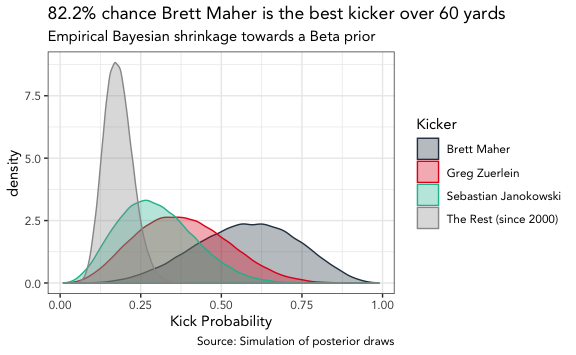

## Question

> Would you believe me if I told you that Cowboys kicker Brett Maher is
> the greatest long-distance kicker in NFL history? Of course not.
> Honestly, I wouldn’t believe me.

Yes, yes I would. But I am also a Cowboys fan. So let’s look at the data
we have from this
[article](https://www.theringer.com/nfl/2019/10/21/20924457/winners-losers-week-7-aaron-rodgers-devonta-freeman).

> Sunday, Maher attempted a 63-yard field goal, tied for the
> second-longest in NFL history. According to NBC’s field goal tracking
> data, it would’ve been good from 66.

The Sunday referenced above was a week 7 game in the 2019 NFL season
against the Philadelphia Eagles. Ok one kick, so what? But there’s more.

> Last week, Maher drilled a 62-yarder. Last year, Maher hit another
> 62-yarder. There have been 22 field goals of 60 yards or longer in NFL
> history. Maher has three of them, more than anybody else in league
> history. Only Sebastian Janikowski and Greg Zuerlein have even made
> two, and Janikowski was 2-for-9 on attempts of over 60 yards and
> Zuerlein is 2-for-5. (We all remember Janikowski’s 76-yard attempt.)
> According to Pro-Football-Reference’s Field Goal Finder, kickers
> besides Maher are 19-for-141 all time on kicks from over 60 yards.
> (They’re a much better 15-for-81 since 2000.)

All in all, Maher is 3 for 3 on kicks beyond 60 yards. Clearly, Maher is
the greater ever. But what exactly are the chances Maher is better than
Sebastian Janikowski and Greg Zuerlein, or even the field?

Inspired by [Introduction to Empirical
Bayes](http://varianceexplained.org/r/empirical-bayes-book/), I set out
to use empirical Bayesian methods to estimate the probability that Brett
Maher is the best there even was from beyond 60 yards.

## Data

``` r
# libraries used in report
library(knitr)
library(kableExtra)
library(tidyverse)
library(ebbr)
library(glue)

# set theme for plots
theme_set(theme_bw(base_family = "Avenir"))
```

First, we create our dataset which includes makes and attempts for Brett
Maher, Sebastian Janikowski, Greg Zuerlein, and all other kickers since
2000. We do Janokowski a favor and remove the ridiculous [76-yard
attempt](https://www.youtube.com/watch?v=ihipthBnwhM) from his numbers.

``` r
# excludes Janokowski's 76-yard attempt
kickers <- tibble(
  player = c("Brett Maher", "Sebastian Janokowski", "Greg Zuerlein", "The Rest (since 2000)"),
  makes  = c(3, 2, 2, 11),
  kicks  = c(3, 8, 5, 67)
)
```

## Model

For our model, we’ll use the `ebbr` package to estimate our bayesian
prior.

Per Introduction to Empirical Bayes (p. 26):

> There are two steps in empirical Bayes estimation:

> 1.  Estimate the overall distribution of your data.
> 2.  Use that distribution as your prior for estimating each average.

The `add_ebb_prior` will “estimate the shape parameters of beta that
underlies many pairs of successes and total” and “adds columns to a data
frame representing empirical Bayes shrinkage towards an estimated beta
prior”.

``` r
kickers <- kickers %>%
  ebbr::add_ebb_estimate(makes, kicks)
```

Once we have our parameters for each player, we will use those to take
100,000 draws of their respoective posterior beta distribution to build
our comparisons.

``` r
simulate_kicks <- function(alpha, beta) {
  sims <- rbeta(1e5, alpha, beta)
}

sim_tbl <- kickers %>%
  mutate(sim_data = map2(.x = (.alpha1), .y = .beta1, simulate_kicks)) %>%
  unnest(sim_data)
```

We can then check the percentage of posterior simulations of one player
that are greater than the other player to obtain our probability
estimate.

The function below will take a single player as an argument and compare
their posterior to each other player in the dataset. It will then return
the smaller difference within the comparisons, which will be the
probability they are the best (better than all the rest).

``` r
probability_best <- function(player_name) {
  
  # player vector
  player_data <- sim_tbl %>%
    filter(player == player_name) %>%
    pull()
  
  # list of other players
  other_players <- sim_tbl %>% 
    filter(!player %in% player_name) %>%
    pull(player) %>%
    unique()
  
  # number of comparisons to make
  num_comparisons <- length(other_players)
  
  # initialize empty vector to hold probabilities
  better_than_probs <- vector(length = num_comparisons)
  
  # loop through other players and extract comparison
  for (i in 1:num_comparisons) {
    
    # other player vector
    other_player_data <- sim_tbl %>%
      filter(player == other_players[i]) %>%
      pull()
    
    # comparison of simulations
    better_than_prob <- mean(player_data > other_player_data)
    
    # add to vector
    better_than_probs[i] <- better_than_prob
    
  }
  
  # smallest value is closest comparison
  return(min(better_than_probs))
  
}

# probability maher is the greatest over 60
maher_prob <- probability_best("Brett Maher")

print(maher_prob)
```

    ## [1] 0.82194

## Results

Below we visualize the posterior simulation to see the comparison of
each player’s distribution. There is an 82.2% probability that Maher is
the best kicker beyond 60 yards.

``` r
color_vals <- c("#2c3e50", "#e31a1c", "#18BC9C", "#999999")

# plot simulated distributions
sim_tbl %>%
  ggplot(aes(sim_data, color = player, fill = player)) +
  geom_density(alpha = 1/3) +
  labs(
    title = glue("{round(maher_prob, 3) * 100}% ",
                 "chance Brett Maher is the best kicker over 60 yards"),
    subtitle = "Empirical Bayesian shrinkage towards a Beta prior",
    x = "Kick Probability",
    color = "Kicker",
    fill = "Kicker",
    caption = "Source: Simulation of posterior draws"
  ) +
  scale_fill_manual(values = color_vals) +
  scale_color_manual(values = color_vals)
```



One thing to note, this probability jumps to over 90% if we use an
uninformed prior, so we are actually taking the more conservative route
in our estimate.

Just like that, we can provide evidence of Maher’s greatness. And as
David Robinson notes at the end of chapter 3:

> But when anyone asks what you did, remember to call it “empirical
> Bayesian shrinkage towards a Beta prior.” We statisticians have to
> keep up appearances.
