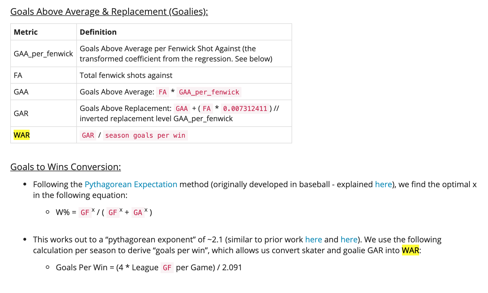
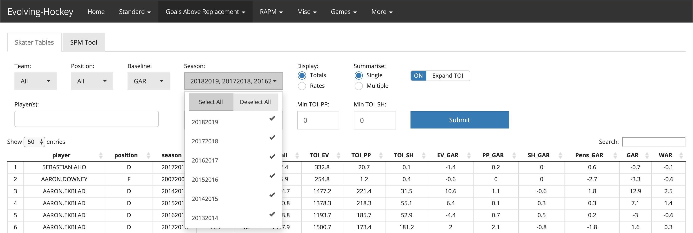
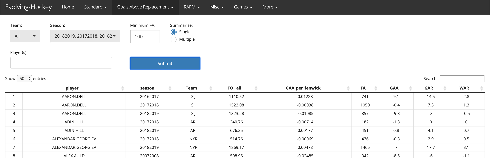

# Introduction

I like to argue about sports. I have a lot of strong opinions that are mostly rooted in my irrational fandom. One of the sports leagues I like arguing about most is the NHL and my favorite sports team is the San Jose Sharks. 

There are a lot of questions that come up in casual (though sometimes heated) fan conversations:
+ Who is the best player in the NHL? What about the worst? 
+ Which players should a team consider off-loading? 
+ Is that player worth a new contract when you need to potentially pay another player? 

Most of the time, there isn't an objectively good way to compare two different players. Sure, we might look at goals or points or some other metric to say that this player contributes more than this other player within some particular context, but there is so much to factor into the equation that it becomes subjective rather quickly. 

This is where WAR, or Wins Above Replacement, comes in. WAR is one of those metrics that aims to level the playing-field:

>WAR stands for Wins Above Replacement (just like baseball) and is one of a handful of catch-all statistics that can be used to evaluate hockey player performance. Specifically, WAR aims to measure a player’s value by calculating the number of wins a player contributes to their team above that of a “replacement level player.” - https://www.blueshirtsbreakaway.com/2018/04/20/hockey-lexicon-spotlight-series-war/

I recently discovered the availability of WAR [Evolving-Hockey.com](https://evolving-hockey.com/). This is a fantastic website that has all sorts of player and goalie advanced analytics.

However, before I start using their WAR as a reason to argue one player's contributions over another, I wanted to validate the link between player WAR and actual team wins. Establishing that link provides reasonable evidence to say player A is better than player B because their WAR is higher.  

# 1. Purpose

## 1.1 Goal

The main goal of this analysis is to establish if there is reason to believe that the player and goalie `Wins Above Replacement (WAR)` is a viable metric for comparing players based in its ability to predict actual team wins. We will then look to see what this means for teams and how they might leverage this type of data for player asset management. 

From an `R` standpoint, I am particularly fond of the `tidyverse`. As such, I wanted to explore a `tidy` framework for statistical modeling that uses `rsample`, `purrr`, `broom`, `yardstick`, and the rest of the `tidyverse`. 

## 1.2 Questions

There are two questions we will focus on answering to better understand the WAR statistic. 

### 1.2.1 How well does aggregated players / goalies WAR predict a teams total wins?

To establish a valid relationship between player / goalie WAR and actual team wins, we will aggregate the season WAR totals for players and goalies to use as predictor variables in a regression model that uses actual team wins as the dependent variable.

This regression model will provide us with 3 key pieces of information:
1. The strength of the correlation between aggreagated player WAR and aggregated goalie WAR with actual team wins. 
2. The amount of "signal" our model captures in actual teams wins in terms of the percentage of variance of actual team wins the model accounts for (r-squared).
3. The expected number of wins a team of replacement-level players would be expected to win in an 82-game season (intercept term).

__Evaluation Metrics__

Our main criteria will be r-squared as a proxy for how much signal our model is capturing in team wins and RMSE to give us the typical size of the error in the same scale of units as our target (# of wins).

### 1.2.2 How many collective WAR does it take to make the playoffs?__

To understand the magnitude of a player or goalie's importance to their team in terms of WAR, we will use a logisitc regression model with wins as the predictor variable and a flag for making the playoffs as the dependent variable. 

The outcome of this is a predicted probability for each number of wins from 0-82. We can then select a threshold for the number of wins to have a strong confidence in making the playoffs and then subtract the expected number of wins for a replacement-level team from our first question to get the added collective WAR needed to make the playoffs. 

This is the metric that management might be most receptive to as it ties a player's contributions directly back to their chances to make the playoffs and helps bring more meaning to the initial WAR statistic. 

__Evaluation Metrics__

Our criteria for the logisitc regression will be accuracy to measure general predictive capability and ROC AUC to understand how well wins seperates the playoff teams from the non-playoff teams. 

## 1.3 Assumptions

In selecting players to use for the aggregated player / goalie WAR, a default filter is used for players and goalies with low minutes played. We left the defaults in place under the assumption that players with too little ice time do not mean as much over a full season and their effect would be part of the error term. For players, the default is 60 minutes. For goalies, the default is based on 100 Fenwick Against (goals, shots on goal, missed shots). 

This also assumes that all teams are more or less affected the same. In other words, each team will have players and goalies that see a little action to be meaningful as a result of prospect development or injuries. 

# 2. Data

## 2.1 Source Data

The data we will be using for this analysis comes from two different sources. 

### 2.1.1 Evolving Hockey

The players and goalies WAR data comes from [Evolving-Hockey.com](https://evolving-hockey.com/). This is a fantastic website that has all sorts of player and goalie advanced analytics. 

Aside from the rich data available at the click of a button, they have provided a [package](https://twitter.com/EvolvingWild/status/1163503829993828353) to scrape NHL data in `R` and the website itself looks to be built using `RShiny`. 

Thank you to whoever runs this website and here is the [link](https://www.patreon.com/evolvinghockey) to become a patron.

The definitions for the calculations can be found in the `Glossary` section of the `More` tab.

__Wins Above Replacement (WAR)__

Their calculation of `Wins Above Replacement (WAR)` is derived from the `Goals Above Replacement (GAR)` calculations (shown below). I don't fully understand what drives the WAR stat, but that's a conversation I'd love to have with the creators to understand this more. In another analysis, we could also use regression to find the biggest drivers from the player stats. 

```{r echo = FALSE, fig.align = "left"}

```

Player and goalie data for 2007-08 through 2018-19 was downloaded from the `Goals Above Replacement` tab. Images of these are below:

__Skaters__
```{r echo = FALSE, fig.align = "left"}

```

__Goalies__
```{r echo = FALSE, fig.align = "left"}

```

### 2.1.2 Hockey Reference

Season standings and champions data was scraped from [https://www.hockey-reference.com/](https://www.hockey-reference.com/). Team standings and champions for every year up through 2018 was scraped using this [python script](https://github.com/bclark86/NHL-Team-History-Scrape/blob/master/NHLStandings_All_Time_Scrape.py). 

The 2019 version of the team standings data is [here](https://www.hockey-reference.com/leagues/NHL_2019.html) (Team Statistics) and the 2019 version of the champions data is located [here](https://www.hockey-reference.com/leagues/). 

__NOTE:__ Due to the [2012-2013 NHL lockout](https://en.wikipedia.org/wiki/2012%E2%80%9313_NHL_lockout), the 2012-2013 was removed from the analysis. This leaves us with 10 seasons of 82 games for the sample. 

## 2.2 Packages

The packages below are what will be used in the analysis. With the exception of `ggplot`, the functions from each package are explicitly stated using the double column operator (`::`). 

```{r setup, include = TRUE, message = FALSE, warning = FALSE}
# customize output options 
knitr::opts_chunk$set(echo = TRUE, warning = FALSE, message = FALSE,
                      fig.width = 6, fig.asp = 0.618, out.width = "70%", 
                      fig.align = "center")

# rmarkdown
library(knitr)
library(kableExtra)

# helpers
library(tidyverse)
library(janitor)
library(skimr)
library(glue)

# pre-processing
library(rsample)

# evaluation
library(broom)
library(yardstick)

# plots
library(GGally)

# pretty tables
library(formattable)

# set theme for plots
theme_set(theme_bw(base_family = "Avenir"))

# color-blind palette
cbPalette <- c("#999999", "#E69F00", "#56B4E9", "#009E73",
               "#F0E442", "#0072B2", "#D55E00", "#CC79A7")
```

## 2.3 Read Data

The function below reads in a csv file and cleans the column names using the `janitor` package. We apply the function to each of the data sets used in the analysis. 

```{r}
read_data <- function(file_name) {
  
  data <- readr::read_csv(file_name) %>%
    janitor::clean_names()
  
  return(data)
}

teams_tbl <- read_data("../data/NHLStandingsAllTime.csv")

champions_tbl <- read_data("../data/NHLChampionsAllTime.csv")

players_tbl <- read_data("../data/Evolving_Hockey_GAA_GAR_Skaters_2019-08-22.csv")

goalies_tbl <- read_data("../data/Evolving_Hockey_GAR_Goalies_2019-08-22.csv")
```

# 3. Exploratory Data Analysis

## 3.1 Data Skim

We are going to use `skimr` to quickly look at the structure of each dataset. This will provide the number of rows and columns, variables types, descriptive statistics for each individual variable, and a histogram for each numeric variable. 

```{r}
teams_tbl %>% skimr::skim()
```

```{r}
champions_tbl %>% skimr::skim()
```

```{r}
players_tbl %>% skimr::skim()
```

```{r}
goalies_tbl %>% skimr::skim()
```

## 3.2 Data Understanding

To get a basic idea of each dataset, we are going to look at league leaders across the different seasons. Additionally, because of my love for the San Jose Sharks, we'll look at their best and worst over the different seasons. 

### 3.2.1 Team Points Percentage

__Worst__

```{r}
teams_tbl %>%
  dplyr::arrange(pts_percent) %>%
  dplyr::slice(1:10) %>%
  dplyr::select(season:pts_percent) %>%
  formattable::formattable()
```

__Best__

The 2018-2019 Tampa Bay Lightning have been regarded as one of the best regular season teams of all-time. They finished with 78% of their total points, which would have had them 10th on the list below. 

```{r}
teams_tbl %>%
  dplyr::arrange(-pts_percent) %>%
  dplyr::slice(1:10) %>%
  dplyr::select(season:pts_percent) %>%
  formattable::formattable()
```

### 3.2.2 Champions

The 2018-2019 season below doesn't have a champion as the data was scraped in August of 2018. 

```{r}
champions_tbl %>%
  dplyr::select(season:runner_up) %>%
  dplyr::slice(1:10) %>%
  formattable::formattable()
```

### 3.2.3 Player WAR

__Worst (All Players)__

```{r}
players_tbl %>% 
  dplyr::arrange(war) %>%
  dplyr::select(player:toi_all, gar, war) %>%
  dplyr::slice(1:10) %>%
  formattable::formattable()
```

__Worst (San Jose Sharks)__

What is most interesting about the list below is that Justin Braun was [traded](https://www.fearthefin.com/2019/6/18/18683743/san-jose-sharks-trade-defenseman-justin-braun-to-philadelphia-flyers) after the 2018-2019 season for a 2nd round draft pick. 

```{r}
players_tbl %>% 
  dplyr::filter(team == "S.J") %>%
  dplyr::select(player:toi_all, gar, war) %>%
  dplyr::arrange(war) %>%
  dplyr::slice(1:10) %>%
  formattable::formattable()
```

__Best (All Players)__

We see that in the same year that Kris Draper had the worst player WAR, Pavel Datsyuk had the best. 

```{r}
players_tbl %>% 
  dplyr::arrange(-war) %>%
  dplyr::select(player:toi_all, gar, war) %>%
  dplyr::slice(1:10) %>%
  formattable::formattable()
```

__Best (San Jose Sharks)__

In looking at the best Sharks' indivudal player seasons, Thornton, Pavelski, and Vlasic helped carry the 2015-2016 team that lost in the Stanley Cup playoffs to the Pittsburgh Penguins. 

```{r}
players_tbl %>% 
  dplyr::filter(team == "S.J") %>%
  dplyr::select(player:toi_all, gar, war) %>%
  dplyr::arrange(-war) %>%
  dplyr::slice(1:10) %>%
  formattable::formattable()
```

### 3.2.4 Goalie WAR

__Worst (All Goalies)__

In terms of WAR, the worst goalie (Steve Mason) was nearly 2x as bad as the #2 goalie.

```{r}
goalies_tbl %>% 
  dplyr::arrange(war) %>%
  dplyr::slice(1:10) %>%
  formattable::formattable()
```

__Worst (San Jose Sharks)__

With the exception of Martin Jones in 2018-19, the rest of the goalies on this list were backups.

```{r}
goalies_tbl %>% 
  dplyr::filter(team == "S.J") %>%
  dplyr::arrange(war) %>%
  dplyr::slice(1:10) %>%
  formattable::formattable()
```

__Best (All Goalies)__

Interesting to note that Henrik Lundquist appears three times in the top 10 list. 

```{r}
goalies_tbl %>% 
  dplyr::arrange(-war) %>%
  dplyr::slice(1:10) %>%
  formattable::formattable()
```

__Best (San Jose Sharks)__

```{r}
goalies_tbl %>% 
  dplyr::filter(team == "S.J") %>%
  dplyr::arrange(-war) %>%
  dplyr::slice(1:10) %>%
  formattable::formattable()
```

# 4. Pre-Processing

## 4.1 Prepare Data

To prepare our dataset for analysis, we need to aggregate player and goalie WAR, join team actual wins, and then categorize playoff outcomes. The joins between teams and players are done via a lookup table.  

```{r}
# aggregate player WAR / GAR
players_summary_tbl <- players_tbl %>%
  dplyr::group_by(season, team) %>%
  dplyr::summarize(
    player_gar = sum(gar),
    player_war = sum(war)
  ) %>%
  dplyr::ungroup() 

# aggregate goalie WAR
goalies_summary_tbl <- goalies_tbl %>%
  dplyr::group_by(season, team) %>%
  dplyr::summarize(goalie_war = sum(war)) %>% 
  dplyr::ungroup()

# create matching keys for players/goalies and teams
team_name_vec <- c(
  "Anaheim Ducks", "Arizona Coyotes", "Atlanta Thrashers", "Boston Bruins",
  "Buffalo Sabres", "Calgary Flames", "Carolina Hurricanes", 
  "Chicago Blackhawks", "Colorado Avalanche", "Columbus Blue Jackets",
  "Dallas Stars", "Detroit Red Wings", "Edmonton Oilers", "Florida Panthers",
  "Los Angeles Kings", "Minnesota Wild", "Montreal Canadiens", 
  "Nashville Predators", "New Jersey Devils", "New York Islanders",
  "New York Rangers", "Ottawa Senators", "Philadelphia Flyers",
  "Phoenix Coyotes", "Pittsburgh Penguins", "San Jose Sharks",
  "St. Louis Blues", "Tampa Bay Lightning", "Toronto Maple Leafs",
  "Vancouver Canucks", "Vegas Golden Knights", "Washington Capitals",
  "Winnipeg Jets"
)

team_abbrv_vec <- c(
  "ANA", "ARI", "ATL", "BOS", 
  "BUF", "CGY", "CAR",
  "CHI", "COL", "CBJ", 
  "DAL", "DET", "EDM", "FLA",
  "L.A", "MIN", "MTL",
  "NSH", "N.J", "NYI",
  "NYR", "OTT", "PHI",
  "ARI", "PIT", "S.J",
  "STL", "T.B", "TOR",
  "VAN", "VGK", "WSH",
  "WPG"
)

# create lookup table
team_lookup_tbl <- tibble::tibble(
  team_name   = team_name_vec,
  team_abbrv  = team_abbrv_vec
)

# create dataset
team_war_tbl <- players_summary_tbl %>%
  dplyr::left_join(team_lookup_tbl, by = c("team" = "team_abbrv")) %>%
  dplyr::left_join(goalies_summary_tbl, by = c("team", "season")) %>%
  dplyr::mutate( season = substr(season, nchar(season) - 3, nchar(season))) %>%
  dplyr::left_join(teams_tbl %>% mutate(season = as.character(season)),
                   by = c("team_name" = "team", "season" = "season"))


team_war_tbl <- team_war_tbl %>%
  dplyr::left_join(champions_tbl %>% 
                      dplyr::mutate(season = paste0("20",
                                                    substring(season,
                                                    nchar(season) - 1))),
                   by = c("team_name" = "champion", "season"))

team_war_tbl <- team_war_tbl %>%
  tidyr::drop_na(gp) %>%
  dplyr::mutate(
    playoffs = dplyr::case_when(
      !is.na(lg)          ~ "cup winner",
      playoffs == TRUE    ~ "playoffs",
      playoffs == FALSE   ~ "no playoffs",
      TRUE                ~ NA_character_
    ) %>% factor(levels = c("cup winner", "playoffs", "no playoffs"))
  ) %>%
  dplyr::mutate(
    playoffs_flag = ifelse(playoffs == "no playoffs", 0, 1),
    playoff_class = factor(ifelse(playoffs_flag == 0, "No", "Yes"))
  ) %>%
  dplyr::filter(season != "2013") %>%
  dplyr::select(season, team, team_name, playoffs, playoffs_flag,
                playoff_class, player_war, goalie_war, w, gf)
``` 

```{r}
team_war_tbl %>% skimr::skim()
```

## 4.2 Data Partitioning

For our basic regression modeling, we will want to create a training and test set to see how well the data generalizes to new data. Once we have an idea of how well the data generalizes, we can fit the model to the full dataset to make use of a larger sample size for inference. 

```{r}
set.seed(808)

split_obj <- rsample::initial_split(team_war_tbl, prop = 0.8)

train_tbl <- rsample::training(split_obj)
test_tbl  <- rsample::testing(split_obj)
```

## 4.3 Data Bootstrapping

To create confidence intervals for the regression metrics, we will create 1000 bootstraps of our data. The `rsample` package will provide a bootstrap sample (analysis set) and an out-of-bag sample of the observations not part of the bootstrap (assessment set). This allows us to build models using the analysis set and then assess them using the assessment set or out-of-bag sample. 

```{r}
set.seed(808)

bt_resamples <- rsample::bootstraps(team_war_tbl, times = 1000)
```

# 5. Modeling

## 5.1 Linear Regression

Our goal with the standard linear regression will be to fit a model on a training dataset, assess it on the test dataset, and then fit a full model to understand the relationships in our data. 

### 5.1.1 Train Model

Here we train or fit a model using the training dataset to predict wins as a function of player WAR and goalie WAR. 

```{r}
# model formula will be used throughout the analysis
mod_form <- as.formula(w ~ player_war + goalie_war) 

ols_train <- lm(mod_form, data = train_tbl)
```

### 5.1.2 Model Summary

Our summary indicates a good fit (adjusted r-sqaured of .733) and each of our predictors as having a significant relationship with wins. Goalie WAR looks to be a little more important than player WAR, but the coefficient also has a larger variance.

We see that a team of replacement-level players would be expected to win about 24 games and that 1 unit of player WAR is worth about .87 actual wins, while 1 unit of goalie WAR is worth about .92 actual wins. 

```{r}
summary(ols_train)
```

### 5.1.3 Actual vs. Predicted

Below we create a table of actual and predicted wins for the train and test set. 

```{r}
train_tbl <- train_tbl %>%
  dplyr::mutate(win_prediction = predict(ols_train, .),
                data = "train")

test_tbl <- test_tbl %>%
  dplyr::mutate(win_prediction = predict(ols_train, .),
                data = "test")

full_tbl <- dplyr::bind_rows(train_tbl, test_tbl)

test_rsq <- test_tbl %>%
  yardstick::rsq_trad(w, win_prediction) %>%
  dplyr::pull(.estimate) %>%
  round(3)
```

Next we create a function to plot the actual wins vs the predicted wins. While subtle, it looks like we are underpredicting the higher win totals and overpredicting the lower win totals. We also see that our model appears to be generalizing well to the new data (red) compared to the training data (grey).


```{r}
# function to replicate plots
plot_predicted_vs_actual <- function(prediction_tbl, 
                                     model_name, 
                                     source_name,
                                     test_rsq) {
  
  p <- prediction_tbl %>%
    ggplot(aes(w, win_prediction, color = data)) +
    geom_point(size = 3, alpha = 1/2) +
    geom_abline(linetype = "dashed") +
    xlim(10,70) + 
    ylim(10,70) +
    scale_color_manual(values = c(cbPalette[7], cbPalette[1])) +
    labs(
      title = glue("{model_name} Predictions"),
      subtitle = glue("Test Set R-Squared: {test_rsq}"),
      caption = glue("Source: {source_name}"),
      y = "Predicted Wins",
      x = "Actual Wins"
    )
  
  return(p)
}

full_tbl %>%
  plot_predicted_vs_actual("Linear Regression", 
                           "w ~ player_war + goalie_war",
                           test_rsq)
```

### 5.1.4 Full Model

Given that the model generalizes well, we'll use the full data set to fit the model and interpret the results. 

We see that a team of average-level replacements would be expected to win about 24 games. Additionally, players and goalies carry virtually equal weight in contributing to wins, but the WAR values are slightly inflated. In other words, player and goalie WAR are worth about 90% of their stated values in terms of actual wins. 

```{r}
ols_full <- lm(mod_form, data = team_war_tbl)

summary(ols_full)
```


## 5.2 Bootsrapped Linear Regression

To explore answering these questions in a slightly different way and understand the uncertainty of our model metrics, we can use bootstrapped regression to fit many models on bootstrapped data. Additionally, with the `rsample` package, we can use the data not included in the bootstrapped sample to evaluate the model. 

We will use the concept of nested tibbles to encapsulate the models, summaries, and predictions into seperate columns for each bootstrap. 

### 5.2.1 Fit Models

First, we create a function to extract the bootstrapped sample and fit a linear model. Then we use the `purrr` package to apply this function to each bootstrapped dataset. 

```{r}
fit_model <- function(splits, ...) {
  # extract analysis data
  analysis_tbl <- rsample::analysis(splits)
  
  # fit model on analysis set of bootstrap
  mod <- lm(..., data = analysis_tbl)
  
  return(mod)
}

bt_resamples$models <- purrr::map(.x = bt_resamples$splits, 
                                  .f = fit_model,
                                  mod_form)
```

### 5.2.2 Model Summaries

Next we create a function to extract the model summary from each bootstrap. 

```{r}
# use glance to extract model metrics for each bootstrap
bt_resamples$model_summary <- purrr::map(.x = bt_resamples$models,
                                         broom::glance)
```

First we extract the model summary for each of the bootstraps and then create a function to plot the distribution of a summary metric of interest along with a specified percentile confidence interval. 

```{r}
# unnest model summary for each bootstrap
model_summary_tbl <- bt_resamples %>%
  select(id, model_summary) %>%
  unnest()

# plot the density distribution of a bootstrap metric
plot_bootstrap_distribution <- function(bootstrap_data_tbl,
                                        var_col,
                                        var_name,
                                        binwidth = .01,
                                        alpha = 0.05) {
  
  var_col <- enquo(var_col)
  
  # quantile calculation
  half_alpha <- alpha / 2
  # chart label
  alpha_pct <- (1 - alpha) * 100
  # confidence interval calculation
  ci_int <- bootstrap_data_tbl %>%
    dplyr::select(!!var_col) %>%
    dplyr::pull() %>%
    quantile(., p = c(0 + half_alpha, 1 - half_alpha)) %>%
    round(2)
  
  # visualize distribution
  bootstrap_data_tbl %>%
    ggplot(aes(!!var_col)) +
    geom_density(fill = cbPalette[6],
                 alpha = 0.75) +
    # add confidence interval
    geom_vline(xintercept = ci_int[1], linetype = "dashed") +
    geom_vline(xintercept = ci_int[2], linetype = "dashed") +
    labs(title = glue("{var_name} Bootstrap Distribution"),
         subtitle = glue("{alpha_pct}% Confidence Estimate: {ci_int[1]} - ",
                         "{ci_int[2]}"),
         x = glue("{var_name}"),
         y = "",
         caption = "Source: Bootstrap Regression Results") +
    theme(axis.title.y = element_blank(),
        axis.text.y = element_blank(),
        axis.ticks.y = element_blank())
  
}
```

For the adjusted r-sqaured, we can see that our model captures 69% to 80% of the variance in actual team wins. 

```{r}
# view distribution for adjusted r-sqaured
model_summary_tbl %>%
  plot_bootstrap_distribution(adj.r.squared, 
                              "Adjusted R-Squared")
```


### 5.2.3 Coefficients

We also want to extract the coefficients from the model and see what their distributions are. To do this, we create a function to extract the coefficients from a fitted linear model and then assign the results to another column. 

```{r}
# function to extract model coefficients
lm_coefs <- function(fitted_model) {
  # extract coefficient tibble
  coefs <- fitted_model %>% broom::tidy()
  
  return(coefs)
}

# extract coefficients for each bootstrap
bt_resamples$coefficients <- purrr::map(.x = bt_resamples$models, 
                                        .f = lm_coefs)
```

Then we extract the results into a tibble and plot the results using a scatter plot matrix. We see that the intercept varies mostly as a result of the player WAR. So as the player WAR importance increases, the expected wins of a team of replacement players decreases. 

```{r}
# unnest coefficients for each bootstrap
lm_coefs <- bt_resamples %>%
  dplyr::select(id, coefficients) %>%
  # Turn it into a tibble by stacking the `models` col
  tidyr::unnest() %>%
  # Get rid of unneeded columns
  dplyr::select(id, term, estimate)

# visual correlation scatter for the model coefficients
lm_coefs %>%
  # Put different parameters in columns
  tidyr::spread(term, estimate) %>% 
  # Keep only numeric columns
  dplyr::select(-id) %>% 
  GGally::ggscatmat(alpha = 0.1)
```

Next we visualize the distributions above with their 95% confidence intervals. 

A team of replacement-level players would be expected to win 23 to 25 games. Player WAR is worth about .82 to .94 actual wins, and goalie WAR is worth about .75 to 1 actual wins. 

```{r}
# Visualize distribition of intercept coefficient
lm_coefs %>% 
  dplyr::filter(term == "(Intercept)") %>%
  plot_bootstrap_distribution(estimate, 
                              "Intercept Coefficient")
```

```{r}
# Visualize distribition of player WAR coefficient
lm_coefs %>% 
  dplyr::filter(term == "player_war") %>%
  plot_bootstrap_distribution(estimate, "Player WAR Coefficient")
```

```{r}
# Visualize distribition of goalie WAR coefficient
lm_coefs %>% 
  dplyr::filter(term == "goalie_war") %>%
  plot_bootstrap_distribution(estimate, "Goalie WAR Coefficient")
```

### 5.2.4 Residuals

Next, we will take a look at the model residuals to get a better idea of how our model is fitting the data. To do this, we create a function to extract the residuals of the data used to fit the model and then we apply that function to each bootstrap sample. 

```{r}
# function to extract residuals from the analysis data
analysis_residuals <- function(splits, fitted_model) {
  
  # extract bootstrap data
  analysis_tbl <- rsample::analysis(splits)
  # calculate fitted and residuals
  resids <- broom::augment(fitted_model, analysis_tbl)
  
  return(resids)
}

# apply residual extraction to each bootstrap
bt_resamples$analysis_residuals <- purrr::map2(.x = bt_resamples$splits,
                                               .y = bt_resamples$models,
                                               .f = analysis_residuals)

```

Then we unnest the residual tibbles and plot the actual values versus the residuals. While not terrible, we do see a bit of a trend with the residuals. Our model is under-predicting larger win totals and over-predicting lower win totals. 

```{r}
# unnest residuals for each bootstrap
residuals_tbl <- bt_resamples %>%
  dplyr::select(id, analysis_residuals) %>%
  tidyr::unnest()

# visualize actual vs. residuals
residuals_tbl %>%
  ggplot(aes(w, .resid)) +
  geom_point(alpha = 1/3) +
  geom_smooth() +
  labs(
    title = "Actual vs. Resdisuals",
    subtitle = "Bootstrap Data",
    caption = "Source: Bootstrap Regression Results"
  )
```

### 5.2.5 Predictions

Here, we will use the holdout, or samples not selected in each bootstrap, to evaluate the predictive strength of the model on new data. We do this by creating a function to make model predictions on the holdout data and apply this function to each bootstrap sample. 

```{r}
# extract predictions on the out-of-sample holdout data
assessment_predictions <- function(split, fitted_model) {
  
  # add predictions to the out-of-sample data
  data <- split %>%
    rsample::assessment() %>%
    dplyr::mutate(
      win_prediction = predict(fitted_model, .)
    )
  
  return(data)
}

# apply predictions to each bootstrap
bt_resamples$assessment_predictions <- purrr::map2(.x = bt_resamples$splits,
                                                   .y = bt_resamples$models,
                                                   .f = assessment_predictions)
```

We then unnest that column of predictions and plot them against the actuals. Our lot is also colored by whether the team made the playoffs or won the chapionship. Our model appears to be doing a decent job of genealizing to new data. 

```{r}
# unnest out-of-sample predictions
assessment_predictions_tbl <- bt_resamples %>%
  dplyr::select(id, assessment_predictions) %>%
  tidyr::unnest()

# visualize predicted vs. actual 
assessment_predictions_tbl %>%
  ggplot(aes(win_prediction, w, color = playoffs)) +
  geom_point(alpha = 1/3) +
  geom_abline(linetype = "dashed") +
  scale_color_manual(values = c(cbPalette[7], cbPalette[4], cbPalette[1])) +
  xlim(10,70) + 
  ylim(10,70) +
  theme(legend.position = "bottom") +
  labs(
    title = "Bootstrap Linear Regression Predictions",
    subtitle = "Holdout Data",
    caption = "Bootstrap Linear Model",
    color = ""
  )
```

Since our data spans 10 different seasons, we can get a better idea of how well the model generalizes across seasons by faceting our prediction plot by the season. While we see some seasons are better fit than others, the model does a pretty good job of generalizing across seasons. 

```{r}
# assessment predictions by year
assessment_predictions_tbl %>%
  ggplot(aes(win_prediction, w, color = playoffs)) +
  geom_point(alpha = 1/3) +
  geom_abline(linetype = "dashed") +
  scale_color_manual(values = c(cbPalette[7], cbPalette[4], cbPalette[1])) +
  xlim(10,70) + 
  ylim(10,70) +
  facet_wrap(~ season, ncol = 5) +
  theme(legend.position = "bottom")
```

### 5.2.6 Evaluation Metrics

Lastly, we will use actual metrics to evaluate the strength of the model The two metrics we are interested in are the r-squared (coefficient of correlation between actual and predicted) and the root-mean sqaured-error (RMSE). 

The r-sqaured will give us an idea of how much predictive signal we are capturing and the RMSE will give us an idea of how much error the typical prediction has. 

As with the other steps, we create a function to extract the metrics of interest for each bootstrap and then capture them in another column of the dataset. 

```{r}
# function to extract rsquared and rmse of dataset
calculate_metrics <- function(data, pred_col) {
  
  # extract predictions based on this column
  pred_col <- enquo(pred_col)
  
  # create metrics tibble
  metrics <- tibble::tibble(
    rsquared = data %>% 
      yardstick::rsq_trad(w, !!pred_col) %>%
      dplyr::pull(.estimate),
    rmse = data %>%
      yardstick::rmse(w, !!pred_col) %>%
      dplyr::pull(.estimate)
  )
  
  return(metrics)
}

# calculate metrics for each bootstrap
bt_resamples$analysis_metrics <- purrr::map2(.x = bt_resamples$analysis_residuals, 
                                             .y = ".fitted",
                                             .f = calculate_metrics)

# calculate metrics for each out-of-bag holdout set
bt_resamples$assessment_metrics <- purrr::map2(.x = bt_resamples$assessment_predictions, 
                                               .y = "win_prediction",
                                               .f = calculate_metrics)
```

We then look at the comparison of the distributions of the bootstrap and holdout metrics across all the samples. As expected, our model performs better on the data used to fit the models, but in general there is considerable overlap between the bootstrap and holdout metrics' distributions. 

```{r}
# extract bootstrap metrics
analysis_metrics_tbl <- bt_resamples %>%
  dplyr::select(id, analysis_metrics) %>%
  tidyr::unnest() %>%
  dplyr::mutate(data = "bootstrap")

# extract out-of-sample holdout metrics
assessment_metrics_tbl <- bt_resamples %>%
  dplyr::select(id, assessment_metrics) %>%
  tidyr::unnest() %>%
  dplyr::mutate(data = "holdout")

# create tibble of bootstrap and holdout metrics
full_metrics_tbl <- bind_rows(analysis_metrics_tbl, 
                              assessment_metrics_tbl)

# visualize distributions
full_metrics_tbl %>%
  tidyr::gather(rsquared, rmse, key = "metric", value = "value") %>%
  ggplot(aes(value, fill = data, color = data)) +
  geom_density(alpha = 0.5) +
  scale_color_manual(values = c(cbPalette[1], cbPalette[7])) +
  scale_fill_manual(values = c(cbPalette[1], cbPalette[7])) +
  theme(axis.title.y = element_blank(),
        axis.text.y = element_blank(),
        axis.ticks.y = element_blank()) +
  facet_grid(cols = vars(metric),
             scales = "free") +
  labs(
    title = "Bootstrap Evaluation Metrics Distribution",
    subtitle = "Bootstrap vs. Holdout Data"
  )
```

We can then plot the distributions of the holdout data with their 95% confidence interval. We so that the model captures 65% to 80% of the variance in actual team wins on unseen data and shows an RMSE of about 3 to 4 wins. 

```{r}
# visualize distribution of holdout r-squared
full_metrics_tbl %>%
  dplyr::filter(data == "holdout") %>%
  plot_bootstrap_distribution(rsquared, "Holdout R-Squared")
```

```{r}
# visualize distribuition of holdout RMSE
full_metrics_tbl %>%
  dplyr::filter(data == "holdout") %>%
  plot_bootstrap_distribution(rmse, "Holdout RMSE")
```

## 5.3 Logistic Regression

To help answer our second question of how much WAR is needed to make the playoffs, we will use a logistic regression model to determine the number of wins needed to be predicted to make the playoffs. We can then subtract our replacement team wins to estimate the remaining number of wins needed from player or goalie WAR. 

### 5.3.1 Train Model

Using the same training split for our initial linear regression, we will fit a logistic regression model to predict making the playoffs based on the number of wins. 

```{r}
# fit logistic regression model
log_reg_train <- glm(playoffs_flag ~ w, data = train_tbl, family = "binomial")

# view model summary
summary(log_reg_train)
```

### 5.3.2 Model Metrics

Next, we will use the test set from the initial linear regression to assess the accuracy and ROC scores. Accuracy will tell us how often our model is right. Since about 50% of teams make the playoffs, this will be a good metric to use. The ROC score will give us an indication of how well our model classifies the separation of playoff teams from non-playoff teams. 

__Prediction Accuracy__

We see our model accurately predicts making the playoffs or not about 88% of the time. 

```{r}
# use levels for turning predictions into factors
lvls <- levels(team_war_tbl$playoff_class)

# add predicted probabilities and classes to test data
test_tbl <- test_tbl %>%
  dplyr::mutate(
    playoff_probabilty = predict(log_reg_train, ., type = "response"),
    playoff_pred       = factor(ifelse(playoff_probabilty > .5,
                                       lvls[2], lvls[1]),
                                levels = lvls))

# calculate accuracy
test_tbl %>%
  yardstick::accuracy(playoff_class, playoff_pred)
```

__ROC AUC Score__

We also see that our model has a ROC AUC score of .96, which means it is doing an excellent job of correctly seperating playoff teams from non-playoff teams. 

```{r}
# calculate ROC AUC score
test_tbl %>%
  yardstick::roc_auc(playoff_class, playoff_probabilty)
```

### 5.3.4 Full Model

Pleased with the performance of our train/test evaluation, we will fit the logistic regression model using the full data set. 

```{r}
# fit logistic regression to full data
log_reg_full <- glm(playoffs_flag ~ w, data = team_war_tbl, family = "binomial")
# view model summary
summary(log_reg_full)
```

### 5.3.5 Playoff Probabilty Curve

Now we will use the fitted model to predict the probability of making the playoffs based on the number of wins. We will use 0 wins to 82 wins (full season) to visualize our playoff probability curve. 


```{r}
# create wins vector with predicted playoff probabilities
wins_tbl <- tibble::tibble(
    w = 0:82
  ) %>%
  dplyr::mutate(
    playoff_prob = predict(log_reg_full, ., type = "response")
  )

# visualize probability curve
wins_tbl %>%
  ggplot(aes(w, playoff_prob)) +
  geom_line() +
  geom_point(alpha = 1/3) +
  labs(
    title = "Playoff Probability Curve",
    caption = "Source: Logisitic Regression Model",
    x = "Wins",
    y = "Probability to Make Playoffs"
  )
```

# 6. Evaluation

We see a dramatic increase in the probability when going from 38 wins to 42 wins. This indicates that the playoff inflection point occurs somewhere around 38 wins with 41 to 43 wins being the minimum threshold target for a team to have a good shot of making the playoffs. 

Paired with our knowledge of a replacement-level team accounting for 23 to 25 wins, a team needs an additional 16 to 20 WAR from their collective players and goalies. 

Referring back up to the top players and goalies of the last 10 seasons, we see that the top goalies captured over 50% of the WAR needed to make the playoffs. While the model indicates that players and goalies may have equal collective value, this finding provides evidence for the importance of a team's goalie. 

In other words, there are 2 goalies contributing to the total goalie WAR, but 15-20 players counting towards the player WAR. So those 2 goalies can be very influential. But if a team doesn't have a dominant goalie, this suggests that a strong team of players can still take an average set of goalies to the playoffs. 

# 7. Conclusion

Going back to our initial questions, we see that player and goalie WAR do a good job of predicting actual team wins. This means that we can then use the WAR values as a single metric for comparing the contributions of different players on different teams, even during different years. 

We can also use that WAR to state a player or goalie's contributions in terms of how much they helped their team make the playoffs based on the ratio of their WAR over 16 to 20. If we expect to need 20 WAR to make the playoffs and a player has 10 WAR, that player proves to be incredibly valuable to that team's success as they contributed about 50% of the added wins necessary. 

### 7.1 Process Improvements

There are a few immediate opportunities for improvement. 

#### 7.1.1 Inclusion Thresholds

We used the default settings from our WAR source to include players and goalies in the analysis. We could include/exclude players and goalies based on different thresholds and see how our model improves. The threshold with the best fitting model would then provide us with a cutoff for when we are able to objectively start comparing players to one-another using WAR. 

#### 7.1.2 Feature Engineering

In our model, all players were grouped together. We could separate forwards and defenseman WAR to use as seperate features, or even break out players by up to all five skater positions (e.g. wingers, centers, etc.). 

### 7.2 Additional Analysis

#### 7.2.1 WAR Driver Analysis

For this analysis, we aggregated player and goalie WAR to see how well they predicted actual team wins. However, the source data has several advanced and standard metrics for each player. Next, we could see which individual stats are best predictive of player and goalie WAR. 

Knowing that WAR is a good measurement of actual team wins, this next analysis would give us a better understanding of which areas a team might want to focus resources on improving based on how much the metric might drive actual player WAR. 

#### 7.2.2 Cluster Analysis

Since all of the player and goalie metrics are calculated within each season, we could z-score standardize the scores within each season and then use those z-scores to perform a cluster analysis of players across seasons. Depending on the player metrics to run the analysis, we might find different "segments" of players based on their advanced stats. Teams could use this to find similar players to ones on their roster when filling a hole due to a player departure/injury or exploring options in free agency. 
