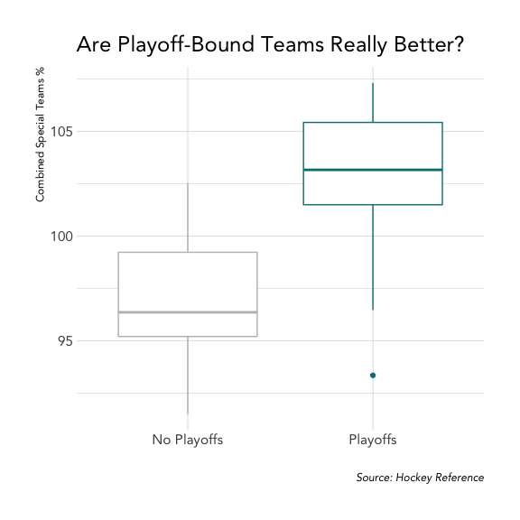
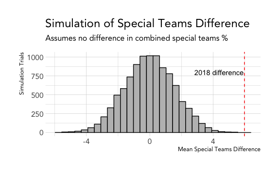

NHL Special Teams % Hypothesis Test
================

## Question

It is often said that defense wins championships. But to win a
championship, you need to make the playoffs. And you make the playoffs,
you need to win hockey games. But how important are special teams (power
play and penalty kill) ability for getting to the playoffs?

To explore this question, we will look to determine if there is a
relationship between whether or not a team makes the Stanley Cup
playoffs and their power play + penalty skill percentage across the
season. In other words, while there are several factors that influence a
team’s chances to make the playoffs, can we detect a statistical
relationship between special teams and if a team made the playoffs?

Our hypothesis is that playoff-bound teams have a higher combined
special teams percentage when compared to teams that did not make the
playoffs. We will test this theory using the `infer` package in R.

## Theorize

The data was scraped from [Hockey
Reference](https://www.hockey-reference.com/) using this [python
script](https://github.com/bclark86/NHL-Team-History-Scrape/blob/master/NHLStandings_All_Time_Scrape.py).

``` r
# replace this with the path of your data file
data_file <- "../data/NHLStandingsAllTime.csv"
teams     <- read_csv(data_file)
```

To test this theory, we will use the 2018 NHL season to compare the mean
combined speical teams percentage of playoff teams to test our theory
that playoff-bound teams have more special teams ability when compared
to non-playoff teams.

However, since this is an observational study, our assumption is that
2017 wasn’t particularly special and our data act like a random sample
of our population of all NHL teams, past and present. In other words, we
are assuming this data is representative of other years. We will need to
take this into account when analyzing our results.

``` r
# replace this with your season of interest
# note: not all seasons contain shooting pct. 
season <- 2018
data <- teams %>%
  filter(Season == season) %>%
  # create special teams variable
  mutate(
    special_teams_pct = `PP%` + `PK%`,
    playoffs = ifelse(Playoffs == "True", "Playoffs", "No Playoffs")
  ) %>%
  select(playoffs, special_teams_pct)
```

``` r
ggplot(data, aes(playoffs, special_teams_pct, color = playoffs)) +
  geom_boxplot() +
  labs(
    title   = "Are Playoff-Bound Teams Really Better?",
    x       = "",
    y       = "Combined Special Teams %",
    caption = "Source: Hockey Reference"
  ) +
  scale_color_manual(values = c("grey", "#008080")) +
  guides(
    color = FALSE
  )
```



## Model

To test our theory, we will use the `infer`package in R to simulate our
null hypothesis and check how rare our observed difference would be if
the null hypothesis (no difference) were
true.


``` r
# calculate observed differece
obs_diff <- data %>%
  group_by(playoffs) %>%
  summarize(mean = mean(special_teams_pct)) %>%
  summarize(stat = diff(mean)) %>%
  pull()

# simulate null universe
null_distn <- data %>%
  specify(special_teams_pct ~ playoffs) %>%
  hypothesize(null = "independence") %>%
  generate(reps = 10000, type = "permute") %>%
  calculate(stat = "diff in means", order = c("Playoffs", "No Playoffs"))

# plot simulation
ggplot(null_distn, aes(x = stat)) +
  geom_histogram(color = "black", fill = "grey") +
  geom_vline(xintercept = obs_diff, color = "red", linetype = "dashed") +
  labs(
    title = "Simulation of Special Teams Difference",
    subtitle = "Assumes no difference in combined special teams %",
    x = "Mean Special Teams Difference",
    y = "Simulation Trials"
  ) +
  annotate("text", x = obs_diff - 1.6, y = 800, 
           label = "2018 difference")
```



Based on our simulation, it looks very unlikely that we would get a
difference as extreme as we saw in 2018 if there truly was no difference
in combined special teams performance between playoff teams and
non-playoff teams.

But just how unlikely is our result?

``` r
# calculate p-value
p_val <- null_distn %>%
  summarize(p_value = mean(stat >= obs_diff)) %>%
  pull()

p_val
```

    ## [1] 0

The p-value indicates our null hypothesis is extremely unlikely, which
means we can reject the null hypothesis and accept our alternative
hypotehsis.

## Synthethize

Our analysis shows that playoff teams had a greater mean combined
special teams ability than non-playoff teams and the results are
statistically signficant based on our permuation test.

Obviously, there is a lot that goes into a team making the playoffs, but
special teams appears to have an important relationship.
